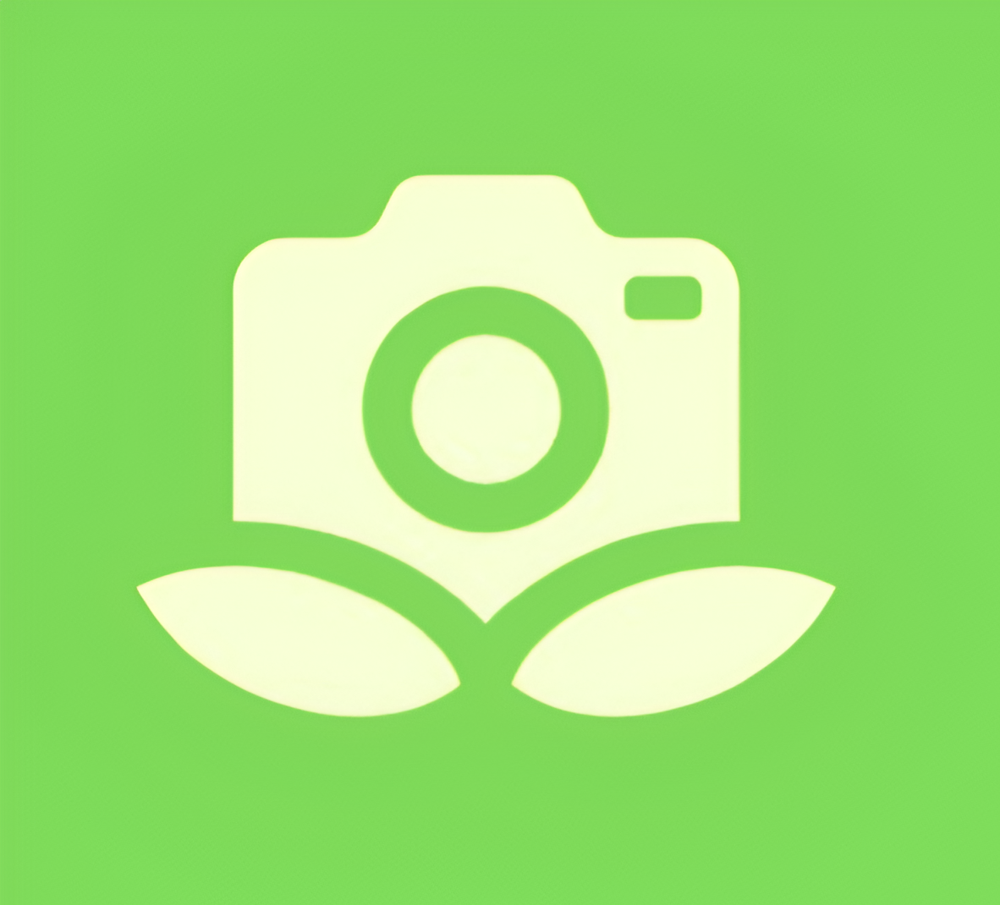

# Green Lens 🌿

### Your AI-Powered Guide to Sustainable Living

<p align="center">
    
</p>

[](https://www.python.org/)
[](https://nextjs.org/)
[](https://fastapi.tiangolo.com/)
[](https://vercel.com/)
[](https://azure.microsoft.com/)
[](https://www.mongodb.com/)
[](https://tailwindcss.com/)
[](https://ai.google.dev/)


## 🌐 Live Demo

Experience Green Lens in action! Visit our live demo site to explore all features and start your sustainability journey today.

**[green-lens-blond.vercel.app](https://green-lens-blond.vercel.app)**

Try uploading an item, discover sustainable alternatives, or join an environmental quest to see how Green Lens can help you make more eco-friendly choices.


**Making sustainable choices easier through AI-powered technology**

## 🚀 Overview

Green Lens is an innovative sustainable living platform that uses AI to help users make environmentally conscious decisions. Whether you're trying to responsibly dispose of an item, find eco-friendly alternatives to everyday products, or contribute to environmental causes through gamified quests, Green Lens provides personalized guidance for reducing your ecological footprint.

## ✨ Key Features

### 🔄 Get Rid of Something
- **AI-Powered Analysis**: Upload a photo of any item, and our AI analyzes what it's made of
- **3Rs Hierarchy**: Get personalized recommendations following the Reduce → Reuse → Recycle hierarchy
- **Detailed Instructions**: Step-by-step guides on how to properly dispose of or repurpose items
- **Recycling Locator**: Find nearby recycling centers that accept your specific items

### 🌱 Acquire Something Sustainably
- **Eco-Friendly Alternatives**: Discover sustainable replacements for everyday products
- **Purchasing Guidance**: Get information on where to buy sustainable products
- **Environmental Benefits**: Learn about the positive impact of choosing greener alternatives

### 🏆 Environmental Quests
- **Gamified Sustainability**: Complete eco-challenges to earn points and badges
- **Progress Tracking**: Monitor your environmental impact with detailed metrics
- **Badge System**: Earn badges for every 100 points up to level 10
- **Community Leaderboard**: Compare your sustainable actions with others

### 🗺️ Recycling Map
- **Interactive Directory**: Locate recycling centers, donation points, and hazardous waste facilities
- **Material Filters**: Find locations that accept specific types of materials
- **Detailed Information**: View hours, contact info, and accepted materials

## 💡 Technologies

| Category | Technology | Description |
|----------|------------|-------------|
| **Frontend** | Next.js | React framework for the web application |
|  | TypeScript | Type-safe JavaScript for robust code |
|  | TailwindCSS | Utility-first CSS framework for styling |
|  | shadcn/ui | High-quality UI components |
| **Backend** | FastAPI | Modern, fast API framework for Python |
|  | MongoDB | NoSQL database for flexible data storage |
|  | Google Gemini | AI model for image analysis and sustainable recommendations |
|  | Pydantic | Data validation and settings management |
| **Deployment** | Docker | Containerization for consistent environments |
|  | Vercel | Frontend hosting and deployment |
|  | Azure | Backend hosting and services |

## 📊 Environmental Impact

Green Lens users can visualize their personal environmental impact through:

- **Carbon Saved**: Track CO₂ emissions prevented (kg)
- **Water Saved**: Monitor water conservation (liters)  
- **Waste Prevented**: Measure waste diverted from landfills (kg)
- **Relatable Comparisons**: See your impact in understandable terms (e.g., "equivalent to not driving X miles")


## 🚀 Getting Started

### Prerequisites
- Node.js 16+ and npm/bun
- Python 3.8+
- MongoDB

## 🚀 Getting Started

> **Note:** The easiest way to experience Green Lens is through our [live demo](https://green-lens-blond.vercel.app). If you prefer to run it locally, follow the instructions below.

### Prerequisites
- Node.js 16+ and npm/bun
- Python 3.8+
- MongoDB

### Installation

#### Frontend
```bash
# Navigate to frontend directory
cd frontend

# Install dependencies
bun install

# Start development server
bun run dev
```

#### Backend
```bash
# Navigate to backend directory
cd backend

# Create and activate virtual environment (recommended)
python -m venv venv
source venv/bin/activate  # On Windows: venv\Scripts\activate

# Install dependencies
pip install -r requirements.txt

# Start the backend server
python -m uvicorn main:app --reload
```

Once both servers are running, access the application at `http://localhost:3000`

## 👥 Contributors

- [Kushal Prajapati](https://github.com/KushalPraja/)
- [Krish Prajapati](https://github.com/KrishPraj/)

## 🙏 Acknowledgements

- [Google Gemini](https://ai.google.dev/) for providing the AI capabilities
- [shadcn/ui](https://ui.shadcn.com/) for the beautiful UI components
- [The sustainable development community](https://sdgs.un.org/goals) for inspiration
